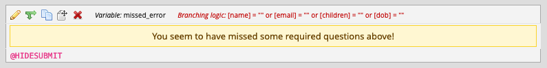
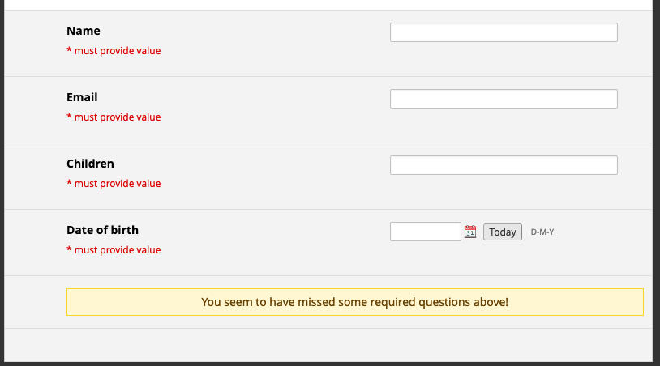
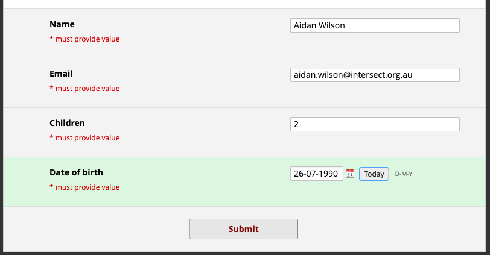
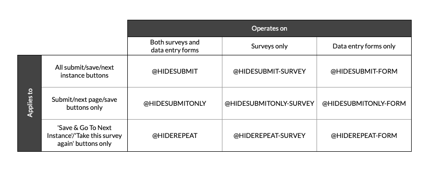
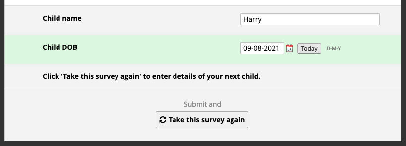
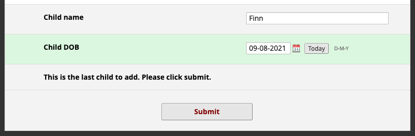

# HIDESUBMIT Action Tags

[](https://doi.org/10.5281/zenodo.5728675)

This REDCap External Module allows users to conditionally hide various Submit/Save/Next instance buttons on surveys and/or data entry forms using Action Tags and branching logic.

The intention is that these action tags are used on descriptive text fields in which the respondent is informed that they cannot continue due to some reason. For example, a user could create a descriptive text field that shows a warning message such as "You appear to have missed some questions!", and use branching logic to display this field if any of the required fields on the page are empty.



As a result of the @HIDESUBMIT action tags, the presence of this descriptive text field will prevent the submit button being displayed.



Once all descriptive text fields with @HIDESUBMIT are no longer visible (according to their branching logic), the submit button immediately becomes visible again.



## Installation

Install the module from the REDCap module repository and enable in the Control Center, then enable on projects.

## Usage

This module adds nine action tags:

- @HIDESUBMIT – Hides all save buttons on data entry forms and both the Submit/Next Page button and 'Take this survey again' button on surveys
- @HIDESUBMIT-FORM – Hides all save buttons on data entry forms
- @HIDESUBMIT-SURVEY – Hides the Submit/Next Page button and the 'Take this survey again' button on surveys
- @HIDESUBMITONLY – Hides all save buttons on data entry forms except for 'Save & Add New Instance', and the Submit/Next Page button on surveys
- @HIDESUBMITONLY-FORM – Hides all save buttons except for 'Save & Go To Next Instance' on data entry forms
- @HIDESUBMITONLY-SURVEY – Hides the Submit/Next Page button on surveys
- @HIDEREPEAT – Hides the 'Save & Go To Next Instance' button on data entry forms and the 'Take this survey again' button on surveys
- @HIDEREPEAT-FORM – Hides the 'Save & Go To Next Instance' button on data entry forms
- @HIDEREPEAT-SURVEY – Hides the 'Take this survey again' button on surveys

These are perhaps better explained in a matrix:



The visibility of an action tag will hide the appropriate submit button, and thus the conditional hiding of the submit buttons is as controllable by the project designer as standard branching logic.

The action tags can be added to any field, although descriptive text fields make the most sense. Hiding the submit button based on the visibility of a question field would be odd, since the response would not be able to be committed to the dataset.

## Examples

### Ensure all required fields are answered

To prevent a respondent prematurely submitting before all required fields are filled, create a descriptive text field with @HIDESUBMIT, and branching logic as desired, which might be a series of checks as below:

```
[name] <> "" or [email] <> "" or ...
```

For a better respondent experience, this descriptive text field should inform them why they cannot proceed, in the example above, the field displays "You seem to have missed some required questions above!".

### Minimum age

A common use case is to limit a survey to respondents over a certain age. Traditionally, this is done using the survey queue. With @HIDESUBMIT this can be achieved using a descriptive text field and branching logic as follows:

```
datediff([dob],"today","y",true) < 18
```
And thus prevents the creation of empty records.

Note that the logic between the survey queue approach and @HIDESUBMIT is reversed; the survey queue will be configured using the logic for respondents to continue (i.e. `datediff([dob],"today","y",true) >= 18`), whereas the @HIDESUBMIT field should use the logic that should prevent a respondent from continuing.

### Multiple exclusion factors

This module allows for a single page to contain multiple @HIDESUBMIT annotated fields. The submit button will be hidden if there are _any_ fields visible with the action tag. This allows users to construct eligibility surveys with multiple exclusion criteria.

### Enforcing form statuses

Project designers may wish to force their users to set data entry forms to complete status rather than unverified or incomplete. The complete status is available for branching logic, and thus can be used to display a warning message than contains @HIDESUBMIT-FORM. Require status to be set to complete using branching logic `[form-name_complete] <> 2` to display a descriptive text field annotated with @HIDESUBMIT. Using smart variables such as `[user-role-label]` in conjunction with this will allow projects to set up workflows, for example, the 'Data entry' role only being able to set form status to Unverified.

### Limit number of repeatable instances

Using @HIDESUBMITONLY and @HIDEREPEAT, it is possible to enforce an upper limit on the number of instances of repeating instruments. For example, a form might ask a respondent how many children they have (`[nr_children]`), and a subsequent repeating form would be configured to collect information on each child. Project designers can limit the number of instances to match the number of children reported with one descriptive text field with branching logic `[current-instance] < [nr_children]`, and annotated with @HIDESUBMITONLY, and a second descriptive text field with logic `[current-instance] >= [nr_children]`, annotated with @HIDEREPEAT, and optionally containing the message 'This is the last child to add'.


The effect of these two fields in tandem is that while the current instance is less than the number of instanced desired, the submit button is hidden and only the 'Take this survey again' button is visible. 



When the number of instances matches the desired number the repeat button is hidden, and only the submit button is visible.



## TODO

- ~~Add action tag instructions to online designer dialogue~~ Added in v2.1.0

## Acknowledgements

This is my first attempt at a REDCap External Module, and I borrowed heavily from other developers including Andy Martin, Ekin Tertemiz, Günther Rezniczek, as well as an earlier hook by Bob Gorczyca. I also drew on help with JavaScript from Luke Stevens, who also suggested the general design of this module. I also used Luke's code to augment the action tag help dialogue on designer pages (see [here](https://github.com/lsgs/redcap-date-validation-action-tags/blob/2d0cff6ad23f278d47decfcffe6478af212e6992/DateValidationActionTags.php#L36)), after a suggestion from Dan Foley.

## Citation

If you use this external module for a project that generates a research output, please cite this software in addition to [citing REDCap](https://projectredcap.org/resources/citations/) itself. You can do so using the APA referencing style as below:

> Wilson, A. (2021). HIDESUBMIT Action Tags [Computer software]. https://github.com/jangari/redcap_hidesubmit https://doi.org/10.5281/zenodo.5728675

Or by adding this reference to your BibTeX database:

```bibtex
@software{Wilson_HIDESUBMIT_Action_Tags_2021,
author = {Wilson, Aidan},
title = {{HIDESUBMIT Action Tags}},
url = {https://github.com/jangari/redcap_hidesubmit},
year = {2021}
month = {7},
doi = {10.5281/zenodo.5728675}
}
```

These instructions are also available in [GitHub]( https://github.com/jangari/redcap_hidesubmit) under 'Cite This Repository'.

## Changelog

| Version | Description                                                                                           |
| ------- | --------------------                                                                                  |
| v1.0.0  | Initial release.                                                                                      |
| v2.0.0  | Adds support for forms as well as surveys.                                                            |
| v2.1.0  | Adds documentation to Action Tag dialogue. Adds support for hiding survey repeat button.              |
| v3.0.0  | Adds support for distinguishing between submit and new instance buttons, and thus 6 more action tags. |
| v3.0.1  | Performance improvement. Buttons are all hidden immediately, and reshown if needed.                   |
| v3.0.2  | Added instructions for citing this repository                                                         |

